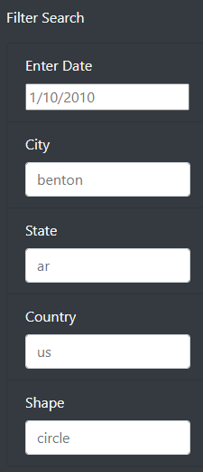
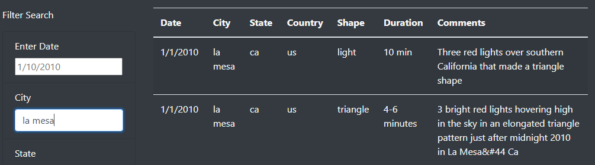

# UFOs
### *"The Truth Is Out There!"*

## Overview of Project:

#### We are to provide a more in-depth analysis of UFO sightings by allowing users to filter for multiple criteria at the same time. In addition to the date, we added table filters for the city, state, country, and shape.

## Results:

#### The web page is very user-friendly.  Once navigating to the site, a user simply scrolls down to see **five,** Filter Search options.

#### Selecting one of these options and inputting the example date will produce results that are diplayed to the left of the search filters.

## Summary:

#### The website works very well.  Typing in a filter will produce quick results that will allow the user to view the requested summary to the right of 
the search area.  A drawback to the site is that it only allows one filter at a time.  This could be very frustrating to the user if they wanted to 
narrow their choices.

#### Future upgrades or additions to the site could be:

    *1. Allowing selection of more than one filter.  This would permit refining the requested data.*
    *2. Clearing of previous filters automatcially.  Currently, you have to remove the filter yourself, adding code to remove the data 
    could be extremely useful and beneficial.*
